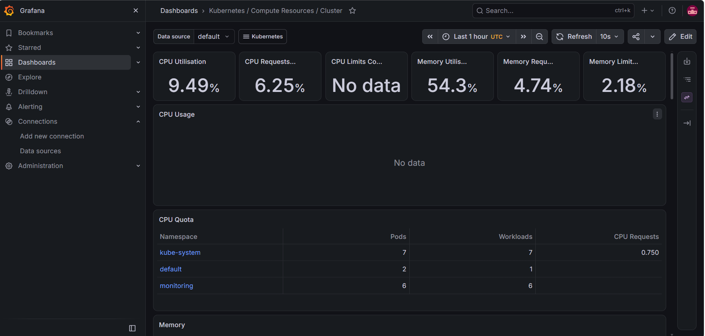

# DevOps Capstone Project — Todo API

An end-to-end DevOps pipeline built from scratch: a FastAPI app that goes from a git push
all the way to a monitored, running service — covering containerization, CI/CD,
infrastructure as code, container orchestration, and observability.

## Architecture

```
Git push → Jenkins (build, test, docker build) → Docker Hub
                                                       │
                        ┌──────────────────────────────┴──────────────────────────────┐
                        ▼                                                              ▼
              Terraform → AWS EC2                                        Kubernetes (Minikube)
              (single instance, Docker)                                   2 replicas, self-healing
                                                                                       │
                                                                                       ▼
                                                                     Prometheus + Grafana (monitoring)
```

## Tech Stack

| Layer | Tool |
|---|---|
| App | Python, FastAPI |
| Containerization | Docker |
| CI/CD | Jenkins |
| Image Registry | Docker Hub |
| Infrastructure as Code | Terraform (AWS EC2) |
| Orchestration | Kubernetes (Minikube) |
| Monitoring | Prometheus + Grafana (kube-prometheus-stack via Helm) |

## Project Structure

```
.
├── app/
│   ├── main.py              # FastAPI app (Todo CRUD API)
│   ├── test_main.py         # Unit tests (pytest)
│   ├── requirements.txt     # Python dependencies
│   └── Dockerfile           # Container build instructions
├── Jenkinsfile               # CI pipeline: checkout → test → build → push
├── terraform/
│   ├── main.tf               # AWS EC2 + security group
│   ├── variables.tf          # Input variables
│   ├── outputs.tf            # Public IP / app URL outputs
│   └── terraform.tfvars.example
├── k8s/
│   ├── deployment.yaml       # Kubernetes Deployment (2 replicas, health checks)
│   └── service.yaml          # NodePort Service
└── README.md
```

## The App

A simple Todo REST API built with FastAPI:

| Method | Path | Description |
|---|---|---|
| GET | `/health` | Health check |
| GET | `/metrics` | Prometheus metrics |
| GET | `/todos` | List all todos |
| POST | `/todos` | Create a todo |
| GET | `/todos/{id}` | Get a todo |
| PUT | `/todos/{id}` | Update a todo |
| DELETE | `/todos/{id}` | Delete a todo |

Run locally:
```bash
cd app
pip install -r requirements.txt
uvicorn main:app --reload
```
Visit `http://localhost:8000/docs` for interactive API docs.

## CI Pipeline (Jenkins)

Every push to `main` triggers a Jenkins pipeline that:
1. Checks out the repo
2. Installs Python dependencies
3. Runs the test suite (`pytest`)
4. Builds the Docker image
5. Pushes the image to Docker Hub, tagged with both the build number and `latest`

See [`Jenkinsfile`](./Jenkinsfile) for the full pipeline definition.

## Infrastructure (Terraform)

Provisions a free-tier AWS EC2 instance that installs Docker on boot and runs the
container automatically, pulling straight from Docker Hub.

```bash
cd terraform
terraform init
terraform apply
```

Outputs the instance's public IP and a direct URL to the running app's Swagger docs.

Tear down when done to avoid charges:
```bash
terraform destroy
```

## Kubernetes Deployment (Minikube)

Runs the app as a 2-replica Deployment with liveness/readiness probes hitting
`/health`, exposed via a NodePort Service.

```bash
minikube start --driver=docker
kubectl apply -f k8s/deployment.yaml
kubectl apply -f k8s/service.yaml
minikube service todo-api-service --url
```

Kubernetes automatically restarts any pod that fails its health check, and
maintains the replica count if a pod is deleted or crashes.

## Monitoring (Prometheus + Grafana)

Installed via the `kube-prometheus-stack` Helm chart, which bundles Prometheus,
Grafana, Alertmanager, and node/kube-state exporters together.

```bash
helm repo add prometheus-community https://prometheus-community.github.io/helm-charts
helm install monitoring prometheus-community/kube-prometheus-stack --namespace monitoring
kubectl port-forward -n monitoring svc/monitoring-grafana 3001:80
```

Grafana ships with pre-built dashboards (Kubernetes / Compute Resources / Cluster,
Prometheus / Overview, etc.) showing live CPU, memory, and pod-level metrics
across the cluster.

## What This Project Demonstrates

- Writing and containerizing a REST API with health and metrics endpoints
- Building a CI pipeline that tests and ships a Docker image automatically
- Provisioning cloud infrastructure declaratively with Terraform
- Deploying and self-healing a containerized app on Kubernetes
- Setting up real observability with Prometheus and Grafana

## Notes

- Docker Hub credentials and AWS access are handled via Jenkins credentials and
  the AWS CLI/Terraform provider respectively — never hardcoded in the repo.
- `terraform.tfvars` and `.tfstate` files are excluded from version control
  (see `.gitignore`) since they can contain environment-specific or sensitive values.


## Project Screenshot

